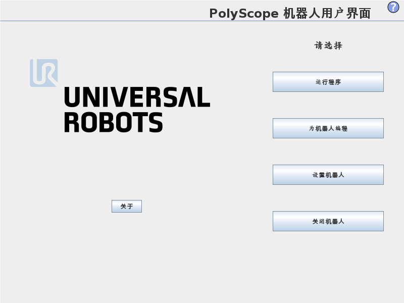

  

#
<big>智能机器人实验一、二实验报告
   

  

###**
 自动化系**
###**
 李昭阳 2021013445**

 

## 工业机器人示教再现实验

### 实验目的

&ensp;&ensp;&ensp;
熟悉UR六自由度工业机器人的基本操作和使用
 
&ensp;&ensp;&ensp;
学会用终端控制机器人运动

### 实验内容

&ensp;&ensp;&ensp;
了解熟悉UR机器人硬件系统和示教终端
 
&ensp;&ensp;&ensp;
用示教终端操作机器人运行
 
&ensp;&ensp;&ensp;
编写简单控制程序操纵机器人完成相关工艺流程

### 操作要点及注意事项

&ensp;&ensp;&ensp;
1. 在操作过程中，要注意精准定位，使得机器人夹具的末端精准定位于目标位置；
 
&ensp;&ensp;&ensp;
2. 在编辑程序过程中，要注意设定好暂停时间，以免上一步操作未完成；
 
&ensp;&ensp;&ensp;
3. 在机械臂运动过程中，要做好碰撞检测，避开可能碰撞的位置。
 
&ensp;&ensp;&ensp;
注意： 在手动调节机械臂时，需要提前按下面板背后的按键，否则会导致机械臂陷入保护锁定状态。
### 机器人终端夹具和工艺流程设置的建议

&ensp;&ensp;&ensp;
机器人夹具可以采取多种形式，希望可以尝试吸盘等多种类工具；
 
&ensp;&ensp;&ensp;
工艺流程中希望可以体验更多不同形式，不局限于夹取。
##工业机器人搬运码垛实验

### 实验目的

&ensp;&ensp;&ensp;
掌握虚拟仿真软件的基础操作
 
&ensp;&ensp;&ensp;
利用模型库搭建搬运码垛工作站
 
&ensp;&ensp;&ensp;
对工业机器人搬运码垛进行简单仿真操作

### 实验内容

&ensp;&ensp;&ensp;
理解掌握工业机器人虚拟仿真概念的基础上，熟悉虚拟仿真软件的基本操作
 
&ensp;&ensp;&ensp;
通过虚拟仿真软件创建机器人工作环境及并进行简单操作，加深对工业机器人的认识

### 心得体会和意见建议

&ensp;&ensp;&ensp;
本次实验中，各项试验的完成度较好，了解了工业机器人使用的方法，学习了有关工业机器人的仿真软件。在仿真到实际实验的过程中，发现了许多sim2real时会遇到的不可预期的问题，包括夹具气泵连接线对机械臂的干扰以及夹具力量不足导致的夹取不稳定。在以后的学习实验中，我会更加注意sim2real带来的问题，同时也会在以后的实验过程中更加谨慎，以保证实验安全且准确。
 
&ensp;&ensp;&ensp;
对整个实验流程而言，我认为实验目的清晰，实验流程完备。感谢实验老师的指导，希望还有机会在老师指导下继续学习体验机器人的各类操作流程。